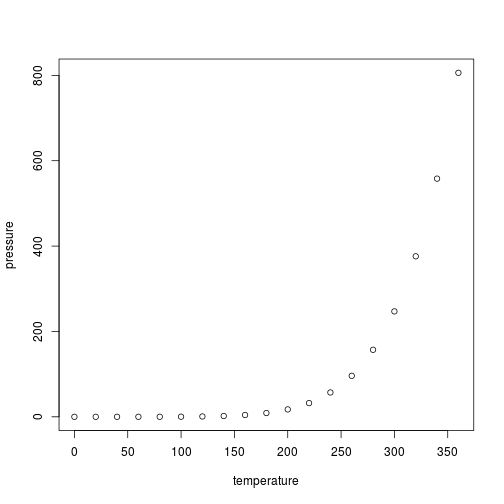

## App Summary

- For this project I use the NCES data for US higher education institutions to generate a shiny app showing the location of all the institutions.
- User can select one of the two tabs "select by school name" and "select by program"
- In each tab, the user can use the dropdown list to select one school or one program to be shown on the map
- The maps are generated using leaflet

## Limitation

Since the data was big, shiny app was too slow, as a result I subseted the program data to include only:
- Computer Science program and all its subcategories
- Bioinformatics
- Medical Informatics
- I plan to later modify the app structure to include more options to work on other programs

## Slide with R Output


```r
summary(cars)
```

```
     speed           dist       
 Min.   : 4.0   Min.   :  2.00  
 1st Qu.:12.0   1st Qu.: 26.00  
 Median :15.0   Median : 36.00  
 Mean   :15.4   Mean   : 42.98  
 3rd Qu.:19.0   3rd Qu.: 56.00  
 Max.   :25.0   Max.   :120.00  
```

## Slide with Plot



